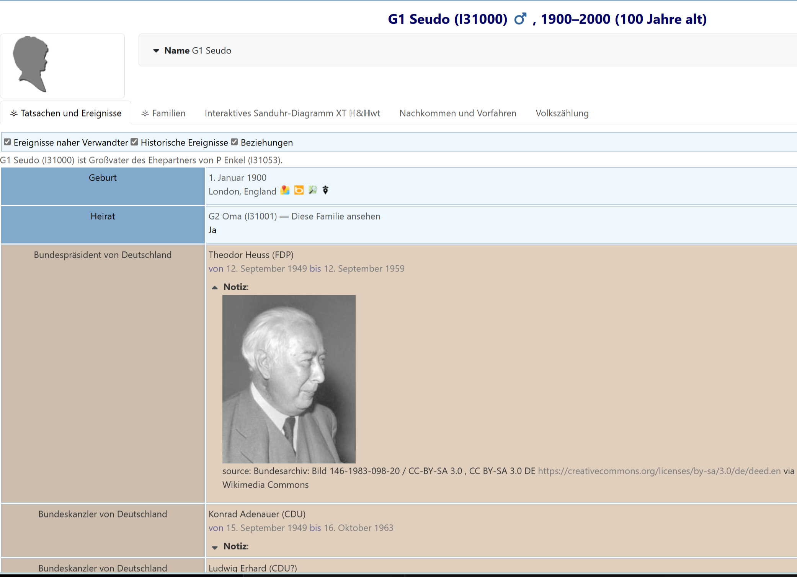

# German Chancellors and Presidents

This provider supplies historical facts for the webtrees timeline: chancellors and presidents of Germany since 1949.

The event text is in German. The provider can use the included CSV data, and `hh-historic-events` also includes a separate optional Wikidata provider for the same topic.

## Usage

Activate the `German Chancellors Presidents` provider in the settings of `hh-historic-events`.

The structure of historic events provided by this provider is oriented on GEDCOM events:

```gedcom
1 EVEN <name> (<party>)
2 TYPE <Chancellor|President> of Germany
2 DATE <date period>
2 NOTE [wikipedia de](<link>) or format including an image (using Markdown)
3 CONT <image attribution>
```

The basic information is stored as a CSV file in `resources/data/csv` and can be edited easily. The comma-separated columns are:

* name and party
* type and subtype, using `C`, `P` and `A` for chancellor, president and acting
* acting time range, using GEDCOM date range format
* Wikipedia article name
* image link, based on Wikimedia Commons, without leading `https://`
* image attribution from the Wikimedia Commons image license

At the moment only the German Wikipedia is supported for this CSV provider.

For Wikipedia links in the notes, Markdown formatting is used. This should be enabled for the tree in `Control panel / Manage family trees / Preferences` in the `Text` section by enabling `Markdown`.

If Markdown is disabled, the links still work, but the formatting is less readable.

Users can view the historical events in the `Facts and events` tab by selecting `Historic events`.

Administrators can modify how historical events are presented in the timeline of a person by using the CSS&JS module. See the [German webtrees manual](https://wiki.genealogy.net/Webtrees_Handbuch/Entwicklungsumgebung#Beispiel_-_Farben_bei_Historischen_Fakten_anpassen).

## Screenshots



## Adding New Data, Programming and Testing

You can contribute to this provider by:

* contributing historical facts: become familiar with the structure of the CSV file, change existing data or add new data, test it, create an issue in [hh-historic-events](https://github.com/hartenthaler/hh-historic-events/issues), and link your pull request
* contributing code: check the issues for work that needs attention; if your change is not covered by an existing issue, create one first
* testing: testing is currently manual; please create an issue for any bugs you find

To get the information for an image link and attribution:

1. Go to the Wikipedia article.
1. Click on an image.
1. Open the details.
1. Select `Use this file`.
1. Copy `File URL` and `Attribution`.
1. Transfer this information into the CSV file. Replace commas in the attribution or enclose the attribution in quotation marks.
