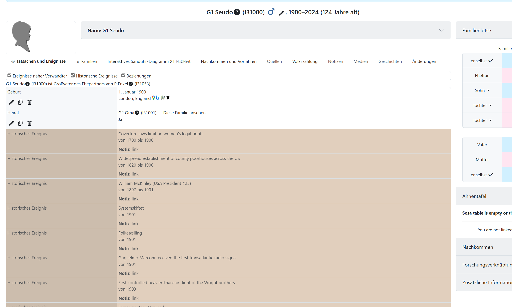

# Gramps Historical Facts

The purpose of this data format is to provide a shared structure for historical event collections. The same files should be usable without modification in both [Gramps](https://gramps-project.org/) and [webtrees](https://webtrees.net/).

This provider shows historical facts in several languages that are based on the [Gramps HistContext gramplet](https://github.com/kajmikkelsen/HistContext).

## Usage

Activate the `Gramps Historical Facts` provider in the settings of `hh-historic-events`.

The structure of historic events provided by this provider is oriented on GEDCOM events:

```gedcom
1 EVEN <event>
2 TYPE <event type>
2 DATE <date period>
2 NOTE [link](<link>)
```

The event type is taken from the optional `category` column of the event row. If that column is empty, the file-level `TOPIC` metadata value is used. Only when both are empty does the module use the translated standard type `Historic event`.

The basic information contains historical events with the date they happened and optionally the date they ended. It is stored as CSV files in `resources/data/csv` and can be edited easily.

The semicolon-separated columns in these files are:

* from date
* to date
* event text
* link to event
* category (optional)

Example:

```csv
1789-04-30;1797-03-04;George Washington;https://wikipedia.org/wiki/George_Washington;Politics
```

Administrators can add or override CSV files in the persistent directory `data/modules/hh-historic-events/data/`. A custom file takes precedence over a bundled file with the same name. The exact server path is shown on the module settings page.

The complete metadata and column format for custom files is documented in [Custom CSV file format](custom-csv-format.md).

An override of the special file `GermanChancellorsPresidents.csv` must retain the comma-separated structure of the bundled file. The general semicolon-separated format described above applies to the Gramps event files.

### Reproducible parser check

To verify backwards compatibility, create one custom file with four columns and another with five columns, enable both sources in the module settings, and open an individual's facts and events tab. The four-column event must use the file's `TOPIC`; the five-column event must use its fifth column as the GEDCOM `TYPE`. A file without a link must not create an empty `NOTE`. Give one file the same name as a bundled CSV and verify that only the custom events are shown for that source.

The file names use the `.csv` extension and follow the pattern `<locale>_data_v1_0.csv`, for example `da_DK_data_v1_0.csv` for events related to Denmark.

General instructions for viewing events, Markdown links, and presentation are documented in the [README](../README.md#Usage).

## Screenshots



General contribution and testing guidance is maintained in the [README](../README.md#Contributing).
